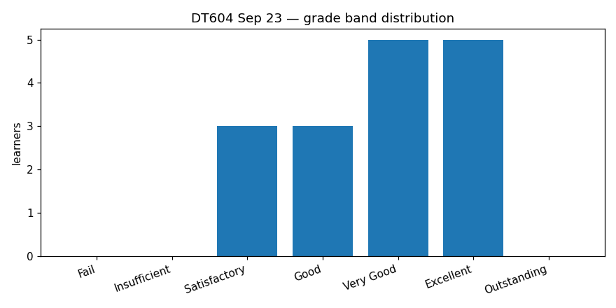
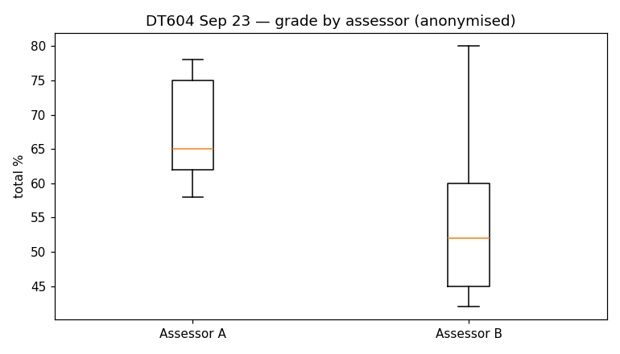
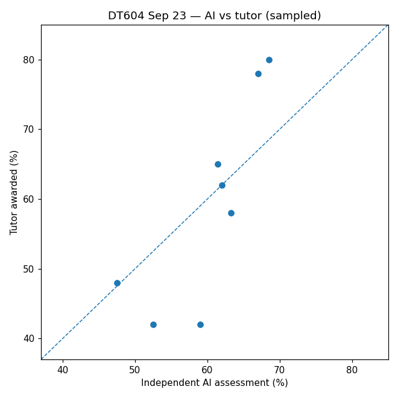
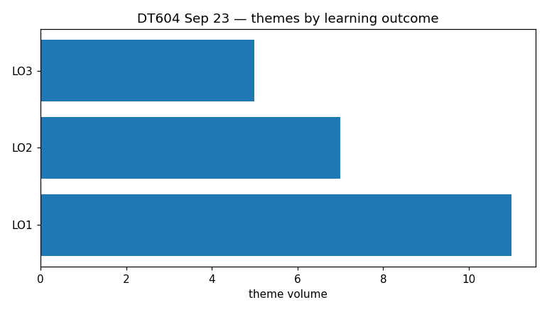

# DT604 — End Point Assessment (Project Report)
## Moderation Report — Sep 23 cohort

*Generated: 2026-05-14 11:10 UTC · Level: L6*

> This report is anonymised. Learner names are omitted; assessors are labelled Assessor A / B / C in order of first appearance in the cohort spreadsheet.

## 1. Overview

- **Module:** DT604 — End Point Assessment (Project Report) (L6)
- **Cohort:** Sep 23
- **Total cohort:** 16 learners
- **Sampled for moderation:** 8
- **Assessors:** 2 (Assessor A, Assessor B)

## 2. Grade distribution

Mean **62.25%** · Median **62.0%** · Std dev **12.01** · Range **42–80%**

| Band | Count | % of cohort |
|---|---|---|
| Outstanding | 0 | 0% |
| Excellent | 5 | 31.2% |
| Very Good | 5 | 31.2% |
| Good | 3 | 18.8% |
| Satisfactory | 3 | 18.8% |
| Insufficient | 0 | 0% |
| Fail | 0 | 0% |

## 3. Inter-assessor consistency

| Assessor | Marked | Mean | Median | Std dev | Min | Max |
|---|---|---|---|---|---|---|
| Assessor A | 9 | 68 | 65 | 7.11 | 58 | 78 |
| Assessor B | 7 | 54.86 | 52 | 13.41 | 42 | 80 |

Mean grade differs by **13.14 percentage points** across assessors.

## 4. AI / tutor agreement

| Verdict | Count |
|---|---|
| endorse-with-note | 1 |
| escalate | 5 |
| endorse | 2 |

Tutors mark on average **0.77 pp lower** than the independent AI assessor on sampled learners.

## 5. Strengths

- Practical Realisation is consistently the cohort's strongest dimension across the sample: learners are deploying real-world data solutions (cloud pipelines, Power BI / Looker / Grafana dashboards, low-code automation workflows, ML lifecycles, star-schema models with documented DAX) in their employer organisations. Adoption impact is genuinely measurable for several submissions — quantified KPI gains, FTE released, contract renewal — anchoring this dimension across multiple bands (LO1, LO2).
- Mature, evidence-based professionalism and ethical reasoning: explicit ethics frameworks (consequentialist / deontological / virtue lenses, GDPR-as-architecture, human-in-the-loop gates, RBAC, audit trails, fairness considerations, descriptive-first staging) appear across the cohort, frequently integrated from DT602 and operationalised in delivery decisions rather than treated as a bolt-on (LO3, LO1).
- Honest, bounded critical reflection on own work — multiple submissions transparently report failed experiments, deferred validation, partially achieved KPIs, and the limits of available data — interpreting what the evidence does and does not support, evidencing the L6 'critically evaluated evidence' descriptor (LO1, LO4).
- Quantified business impact tied to pre-defined KPIs at the top of the band: high-performing submissions reported measured outcomes (77% processing-time reduction, 49% workload reduction, 27% completion-time reduction, 10%→26% assessment-completion adoption, 564-box BoL variance, FTE released, contract renewal) directly traceable to scope-stage KPIs (LO2, LO4).
- Programme-wide synthesis visible in several submissions — explicit references back to DT401–DT603 (Data Fundamentals, Project Management, Secure Systems, Data Solutions Architecture, Research Ethics, Data Analysis Solution) evidence the brief's expectation that the EPA Project Report integrates learning across the apprenticeship (LO1).

## 6. Points for improvement

- Academic evidence base is consistently thin: recurring narrow reference lists (2–11 sources), references listed in bibliographies but not cited inline anywhere in the body, and bibliographies dominated by self-citation to prior DT module assessments. Widening the cited literature with peer-reviewed industry and academic sources, citing them inline at points of claim, and evaluating competing perspectives rather than listing them would lift Critical Thinking and Discipline Skills and Knowledge across the cohort (LO1, LO4).
- Communication register slips hold this criterion below its substantive level: typos ('eventhough', 'subsequential', 'Fig 503B', 'Kanan approach'), informal phrasing ('in a nutshell', 'without breaking the bank'), missing or external figure captions, awkward clause inversion, word-count outliers (one submission 21% under minimum, another at the upper bound, another with the cover-page count unfilled), and external Drive figure references that breach the EPA-standalone requirement (LO2, LO4).
- Collaboration described as coordination rather than co-creation: stakeholder engagement is consistently presented as facilitation, RACI mapping, asynchronous broadcasting or biweekly forums rather than 'strong, valuable contributions' with evidenced negotiation, conflict resolution, or shared decision-making. Capturing the substance of collaborative working (joint deliverables, examples of influence, decision-changing feedback) would lift this criterion (LO3).
- Informed Decision Making lacks statistical rigour in places: small qualitative samples driving multiplier hypotheses, low R² reported without interrogation, deferred train/test validation strategies, and missing significance testing appear in sampled work. Embedding model validation, confidence intervals and significance testing into v1 design rather than post-hoc back-tests would push this criterion higher (LO1, LO4).
- Brief-compliance discipline: four of eight sampled submissions had material compliance items (DOCX rather than required PDF in two cases; word count materially below 6000±10% in one case; cover-page word-count placeholder unfilled in another; missing Harvard references; missing Generative AI log appendix in three cases; broken or confidentiality-blocked artefact links; empty in-body KPI section and appendices). These are easy to remediate and directly affect Digital Proficiency and Professionalism marks (LO2, LO3).

## 7. Themes by learning outcome

| LO | Description | Theme volume |
|---|---|---|
| LO1 | Critically reflect upon project outcomes, evaluate professional working practices, and communicate with a good understanding of the audience and purpose. | 11 |
| LO2 | Communicate findings from the data analysis solution project with a good understanding of the audience and relevance to the organisational business context. | 7 |
| LO3 | Employ a range of digital tools to produce a developmental portfolio demonstrating application of knowledge, skills and behaviours | 5 |

## 8. Recommendations

- Recalibrate Excellent-band marking against L6 rubric descriptors. The two Excellent awards in the sample show ~11pp negative deltas against independent review with five-to-seven criterion-level disagreements each; tutor narratives frequently sit one band above the descriptor language they're anchored to on Critical Thinking, Communication, Professionalism and Informed Decision Making. A calibration session focused on what distinguishes Very Good from Excellent on each criterion — especially when Practical Realisation is genuinely Excellent but academic underpinning is not — would close this gap before the next cohort.
- Tighten feedback coverage against the brief's core requirements. Feedback narratives across multiple sampled learners did not address Project Plan / risk-and-issue decisions, KPI-based outcomes evaluation, or Recommendations and Conclusions, and did not consistently name Collaboration (LO3) or Practical Realisation (LO1) as rubric criteria. A feedback template structured around the brief's seven core requirements and the ten rubric criteria — with mandatory rubric-descriptor anchoring on every strength and improvement bullet — would close these gaps and tighten path-to-higher-band signposting.
- Enforce pre-submission compliance checks for the EPA. Half of sampled submissions had brief-compliance issues that should not have reached moderation in this state. A pre-submission checklist (PDF format, cover-page word count filled, Generative AI log appendix attached if AI used, Harvard references with inline citations, no confidentiality-blocked artefact links, dashboard screenshots embedded) plus a tutor sign-off step before the Turnitin upload window would catch these and avoid the human-review burden at moderation.

## 9. Methodology

Moderation followed a four-agent pipeline per sampled learner with strict information firewalls:

1. **Independent AI assessor** — read only the brief, level rubric and learner work; never saw the tutor's grade or feedback.
2. **Feedback auditor** — read only the brief, level rubric and tutor's written feedback; never saw the learner work.
3. **Assessment comparator** — compared the AI assessment against the tutor's grade and feedback; emitted a verdict (endorse / endorse-with-note / escalate).
4. **Moderation writer** — synthesised the moderator comment and recorded it against each sampled learner.

Sampling targeted ≥6 learners spanning the populated grade bands. The full cohort (including non-sampled learners) is recorded in the anonymised analytics database for trend analysis.

---
*Anonymised report generated by the apprenticeship moderation tool.*
